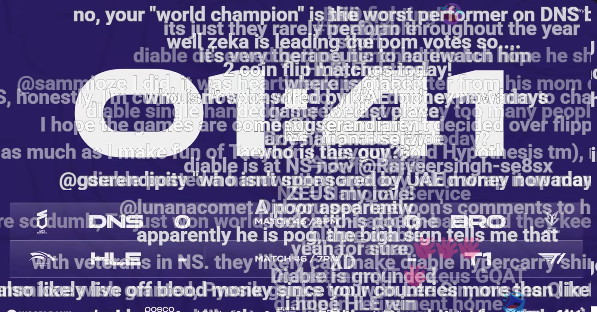

# Danmaku Flow for YouTube

> Bring polished danmaku-style live comments to YouTube with stream-ready chat controls and customization.

Danmaku Flow for YouTube is a Chrome extension that turns YouTube live chat
messages into flowing on-screen overlays. It helps present live comments more
like danmaku or floating subtitles, while keeping the display customizable and
easier to manage during busy streams.

## Acknowledgements

This project is based on and inspired by the work of
[tsukumijima/youtube-live-chat-flow](https://github.com/tsukumijima/youtube-live-chat-flow)
and its [subdiox/youtube-live-chat-flow](https://github.com/subdiox/youtube-live-chat-flow) fork.
Many thanks to the original author and the fork maintainer for creating and sharing the project.

## Features

- Display YouTube live chat messages directly over the video as flowing comments.
- Customize message appearance, including color, size, width, opacity, outline, and speed.
- Control whether author names and avatars are shown for different user types.
- Support Super Chats, Super Stickers, and Membership messages.
- Adjust layout behavior such as line count, max lines, stacking direction, and overflow mode.
- Move the chat input to the video controls area and add helper buttons to the chat list.
- Toggle flowing comments with the **Flow messages** button in the YouTube player controls.
- **Hide Chat After Page Load**: hide the chat panel after the page finishes loading while
  flowing comments are enabled; the chat reappears when they are disabled.
- **Always Show Chat**: keep the chat panel visible for YouTube Premieres, where it is hidden
  by default.
- Limit message rate with `Max Displays per second`.
- Limit simultaneous on-screen overlays with `Max Active Displays` to reduce lag during heavy chat traffic.
- Reset all extension settings to their default values from the options page.

## Screenshots



## Installation

1. Build the extension with `npm run build`.
2. Open the Extension Management page by navigating to `chrome://extensions`.
3. Enable Developer Mode by clicking the toggle switch next to **Developer mode**.
4. Click the **LOAD UNPACKED** button and select the `app` directory.

To create a distributable archive for this fork, run `npm run package` and use the generated `dist/archive.zip` file.

## Development

```bash
# install dependencies
npm install

# production build output to ./app
npm run build

# watch source changes and enable MV3 hot reload workflow
npm run dev

# watch webpack only
npm run watch:src

# lint the project
npm run lint

# create distributable zip in ./dist
npm run package
```

## Build And Debug

### Build Modes

```bash
# production build (minified)
npm run build

# development build without minification, suitable for Chrome DevTools
npx webpack --config webpack.config.js --mode development --devtool source-map
```

### Load The Extension In Chrome

1. Open `chrome://extensions`.
2. Turn on **Developer mode**.
3. Click **Load unpacked**.
4. Select the `app` directory.
5. After rebuilding, click **Reload** on the extension card.

### Debug Content Scripts

1. Build with source maps:

```bash
npx webpack --config webpack.config.js --mode development --devtool source-map
```

2. Reload the unpacked extension in `chrome://extensions`.
3. Open a YouTube watch page.
4. Press `F12` to open Chrome DevTools on that page.
5. Open **Sources**.
6. Use `Ctrl+P` and search for `content-script.ts` or `content-script-iframe.ts`.
7. Set breakpoints and refresh the YouTube page.

### Notes

- `npm run build` writes the extension bundle to the `app` directory.
- `webpack.config.dev.js` uses `cheap-module-source-map` for development watch mode.
- Avoid eval-based devtool settings for MV3 testing, because Chrome extension CSP blocks `unsafe-eval`.

```

```
