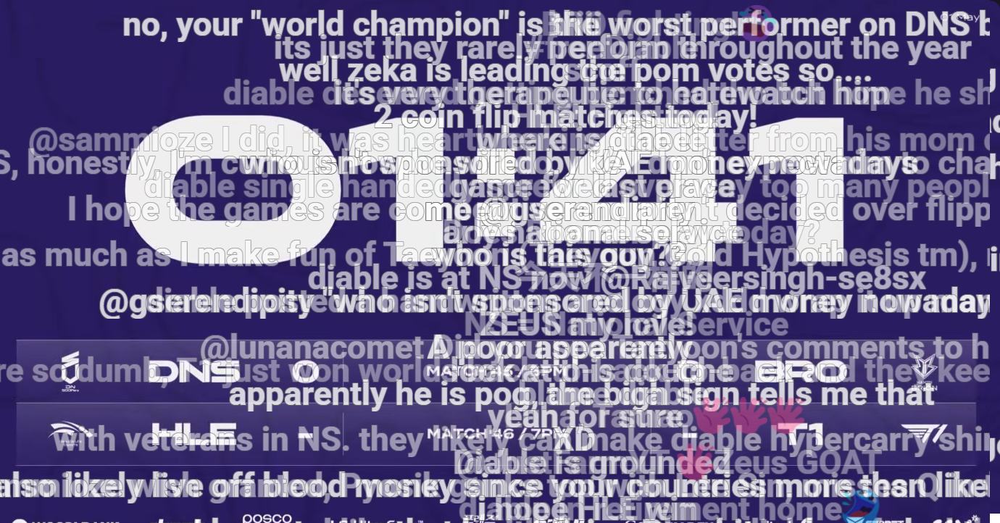

# Danmaku Flow for YouTube

> Bring polished danmaku-style live comments to YouTube with stream-ready chat controls and customization.

Danmaku Flow for YouTube is a Chrome extension that turns YouTube live chat
messages into flowing on-screen overlays. It helps present live comments more
like danmaku or floating subtitles, while keeping the display customizable and
easier to manage during busy streams.

## Install from Chrome Web Store

[Download Danmaku Flow for YouTube from the Chrome Web Store](https://chromewebstore.google.com/detail/danmaku-flow-for-youtube/enfiknigldbijeoafkmnncphbgmhnnje)



Built for YouTube live streams, watch parties, and any video where you want
customizable danmaku without losing control of the chat.

Currently supports Google Chrome and YouTube live chat.

## Features

- Display YouTube live chat messages directly over the video as flowing comments.
- Choose recommended viewing scenarios for Full Screen, Game, or Chat, each with independent settings.
- Customize font size, comment width, opacity, outline thickness, speed, and background appearance.
- Choose which user types appear, along with their author names, avatars, colors, and message layouts.
- Support Super Chats, Super Stickers, and Membership messages.
- Available in 12 languages and automatically selects a supported browser language on first install.
- Control simultaneous comment rows, where new comments begin, and what happens when space runs out.
- Move the chat input to the video controls area and add helper buttons to the chat list.
- Toggle flowing comments with the **Toggle Danmaku** button in the YouTube player controls.
- Hide the chat panel in fullscreen while keeping flowing comments active; it returns when you exit fullscreen.
- **Always Show Chat**: keep the chat panel visible for YouTube Premieres, where it is hidden
  by default.
- Limit the rate and number of comments on screen to reduce lag during busy chat traffic.
- Reset all extension settings to their default values from the options page.

## Support Development

Danmaku Flow for YouTube is independently developed and maintained. If it
makes your streams or watch parties more enjoyable, consider supporting future
updates and maintenance.

[](https://paypal.me/OwOJoyce)

Found an issue? [Open a GitHub issue](https://github.com/joyceowo/danmaku-flow-for-youtube/issues).

## Quick Start

1. Install the extension from the Chrome Web Store.
2. Open a YouTube live stream or Premiere with live chat.
3. Click **Toggle Danmaku** in the player controls, then open the extension options to customize the display.

## Developer Installation

For local development or testing, load the built extension directly in Chrome.

1. Build the extension with `npm run build`.
2. Open the Extension Management page by navigating to `chrome://extensions`.
3. Enable Developer Mode by clicking the toggle switch next to **Developer mode**.
4. Click the **LOAD UNPACKED** button and select the `app` directory.

To create a distributable archive, run `npm run package` and use the generated
`dist/danmaku-flow-for-youtube-v<version>.zip` file.

## Development

```bash
# install dependencies
npm install

# production build output to ./app
npm run build

# watch source changes and enable MV3 hot reload workflow
npm run dev

# watch webpack only
npm run watch:src

# lint the project
npm run lint

# create a versioned distributable zip in ./dist
npm run package
```

### Load the Extension in Chrome

1. Open `chrome://extensions`.
2. Turn on **Developer mode**.
3. Click **Load unpacked**.
4. Select the `app` directory.
5. After rebuilding, click **Reload** on the extension card.

### Debug Content Scripts

1. Build with source maps:

```bash
npx webpack --config webpack.config.js --mode development --devtool source-map
```

2. Reload the unpacked extension in `chrome://extensions`.
3. Open a YouTube watch page.
4. Press `F12` to open Chrome DevTools on that page.
5. Open **Sources**.
6. Use `Ctrl+P` and search for `content-script.ts` or `content-script-iframe.ts`.
7. Set breakpoints and refresh the YouTube page.

### Notes

- `npm run build` writes the extension bundle to the `app` directory.
- `webpack.config.dev.js` uses `cheap-module-source-map` for development watch mode.
- Avoid eval-based devtool settings for MV3 testing, because Chrome extension CSP blocks `unsafe-eval`.

## Privacy

Chat processing and rendering happen locally in your browser. Extension settings
are stored in `chrome.storage.local`. See the full [Privacy Policy](docs/privacy-policy.md).

## Release Notes

[View the latest version and complete release history on GitHub Releases.](https://github.com/joyceowo/danmaku-flow-for-youtube/releases)

## Acknowledgements

This project is based on and inspired by the work of
[tsukumijima/youtube-live-chat-flow](https://github.com/tsukumijima/youtube-live-chat-flow)
and its [subdiox/youtube-live-chat-flow](https://github.com/subdiox/youtube-live-chat-flow) fork.
Many thanks to the original author and the fork maintainer for creating and sharing the project.

## License

[MIT License](LICENSE)
